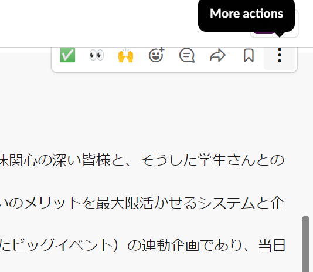
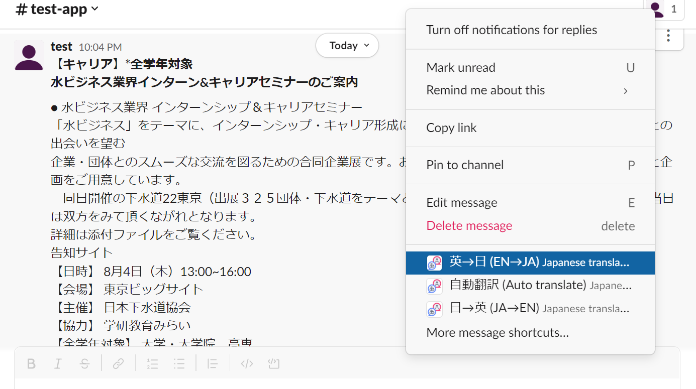
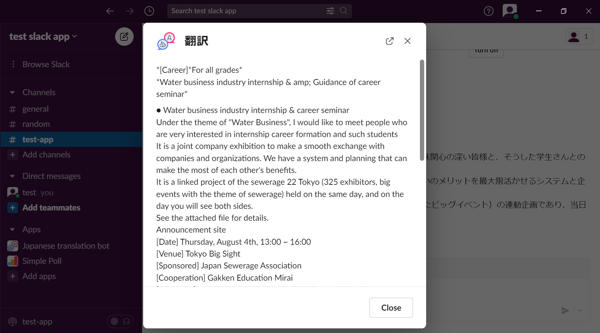
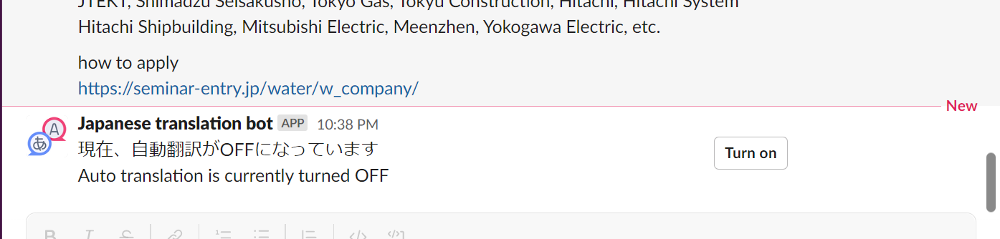
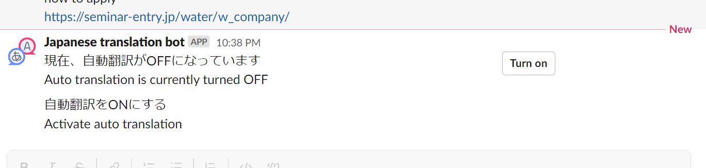
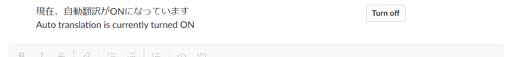
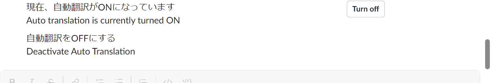
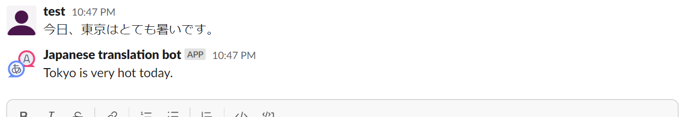

# Japanese translation Slack bot

This Slack bot can automatically and manually translate message in chat between Japanese and English. This bot intends to help international students in Computer science department of Toyo University (INIAD) to translate conveniently messages in Japanese.  

## How does the bot work?
- After the bot is added to the Slack workspace, when we click at "More actions" in each message, we have quick options like this:

- There are 3 options:
    - Manually translate from Japanese to English
    - Manually translate from English to Japanese
    - Automatically translate from Japanese to English

### Manual translation
- When using manual translation, the bot will create translation ephermeral message (which only that person can see, other people cannot) and a translation pop-up modal.

 </>

 </>

### Automatical translation
- When click automatic translation option, the bot will show if auto translation is enabled in this channel or not.

    - If it is not enabled, the turn on button will be shown. After turn on, confirmation message will appear.
    
 </>
    
 </>
    
    - If it is enabled, the turn off button will be shown. After turn off, confirmation message will appear.
    
 </>
    
 </>

- When automatic translation is on, if any Japanese message is sent, the bot will auto translate that message.

 </>
